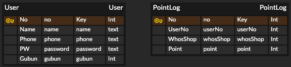

# OpenSource-NAON  
Hanyang Univ. ERICA Open source S/W Assignment Customer membership management app service for small and medium merchants 'NAON'

---

### 0️⃣ 개발기준 하드웨어 및 소프트웨어 사양
### 0️⃣ Development standard hardware and software specifications
---


---

### 1️⃣ 개발 전 Flask, MySQL 설치 및 확인과정 (Pre-development process for installing Flask, MySQL)  
---
#### 1. Flask 설치 과정 (installing Flask) ( * Python 3.8 Version이 이미 설치되어 있다고 가정함, Suppose Python 3.8 Version is already installed. )
  1. 다른 Python 프로그램들과 Flask 서버 Python 프로그램과 충돌을 방지하기 위해, virtualenv를 설치합니다. (in Macbook pro 'terminal.app')
  1. To avoid conflicts with other Python programs and Flask server Python programs, install virtualenv.
    ```
    $ sudo pip3 install virtualenv
    ```
    
  2. pip3를 이용하여 Flask 라이브러리를 설치합니다.
  2. Install Flask library using pip3.
    ```
    $ sudo pip3 install flask
    ```
#### 2. MySQL 설치 과정 (installing MySQL)
  1. Terminal을 이용하여 MySQL을 설치하기 위해 Homebrew(MacOS 패키지관리자)를 설치합니다.
  1. Install Homebrew (MacOS Package Manager) to install MySQL using Terminal
    ```
    $ /bin/bash -c "$(curl -fsSL https://raw.githubusercontent.com/Homebrew/install/master/install.sh)"
    ```
  2. Brew 패키지관리자를 이용하여 MySQL 설치합니다.
  2. Install MySQL using Brew Package Manager.
    ```
    $ brew install mysql
    ```
  3. Brew 패키지관리자를 이용하여 MySQL의 서비스를 시작합니다.
  3. Start MySQL service using Brew package manager.
    ```
    $ brew services start mysql
    ```
  4. root 권한(sudo)으로 MySQL을 실행합니다.
  4. Run MySQL with root privileges (sudo).
    ```
    $ sudo mysql
    ```

#### 3. python과 MySQL을 연동하기 위한 pymysql 설치 과정 (installing pymysql)
  1. Terminal을 이용하여 pymysql을 pip3로 설치합니다.
  1. Install pymysql as pip3 using Terminal.
    ```
    $ pip3 install pymysql
    ```
---

### 2️⃣ Android Application UI / UX 디자인 ( * 실제와 다소 차이가 있을 수 있음 )
---
#### 1. 매장고객 사용 Android Application UI / UX 디자인
#### 1. Android Application UI / UX design for store customers
  | a. intro screen | b. login screen | c. shop list | d. points log in shop |
  |----|----|----|----|
  |||||  
#### 2. 점주 사용 Android Application UI / UX 디자인
#### 2. Android Application UI / UX design using store owner
  | a. intro screen | b. login screen | c. add point | d. new customer sign up | e. after add point |  
  |--------|--------|--------|--------|--------|
  |||||  
---

### 3️⃣ Database ERD (Entity-Relation Diagram)
---

